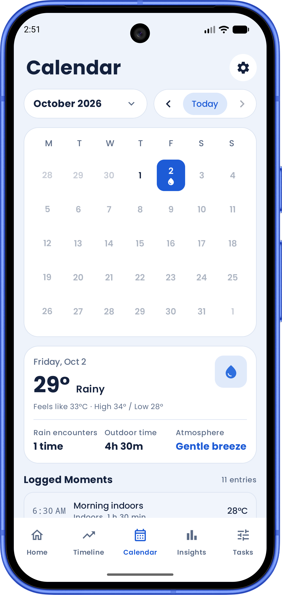
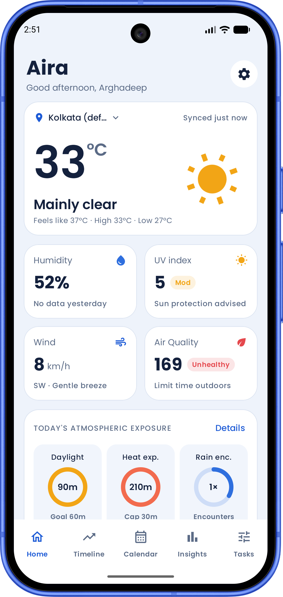
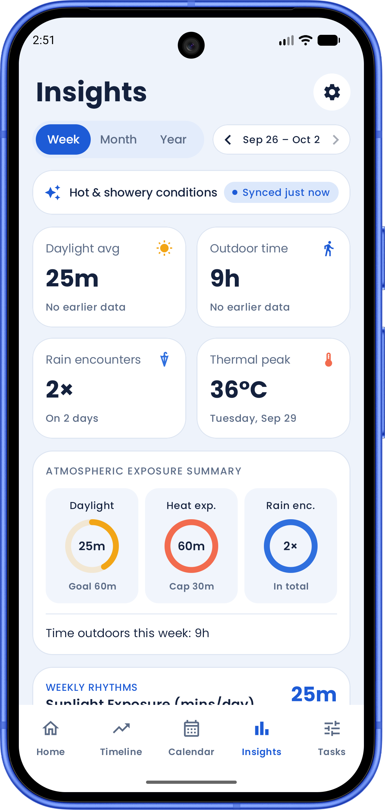
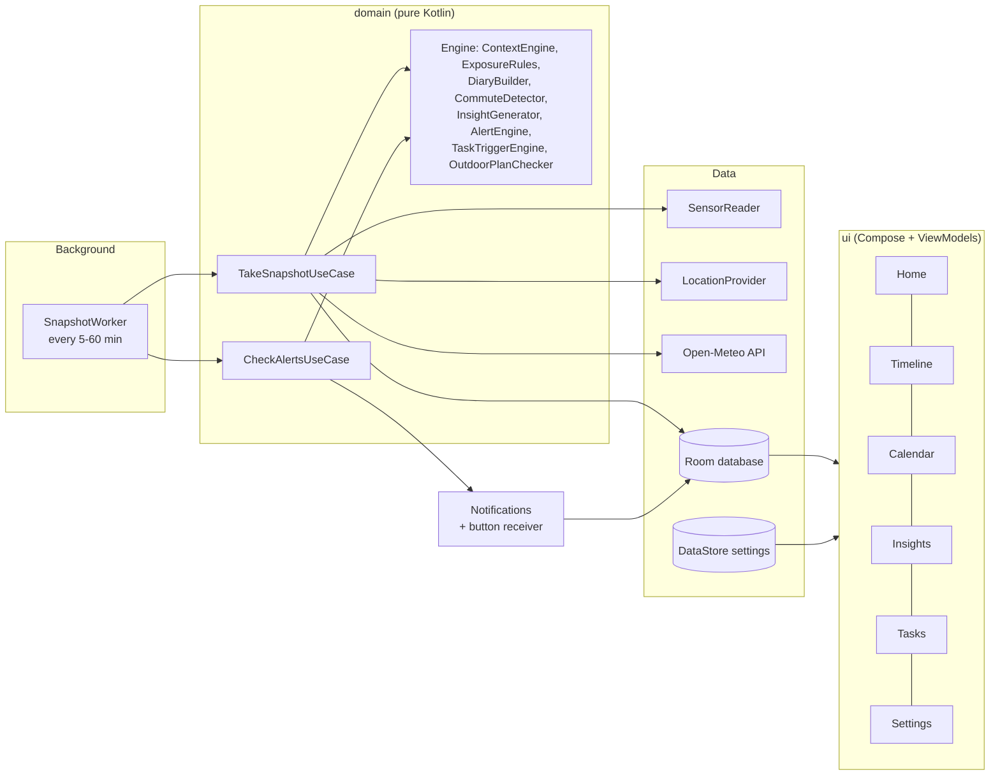

# Aira: A Personal Weather Diary


-3DDC84)


<p align="center">
  
  
  
</p>

Aira is an Android app that records the weather **you personally experienced**, not just the forecast for
your city. Every 5 minutes (or 15, 30 or 60) it takes a *snapshot*: your location, the readings of your phone's sensors
and the weather from the free Open-Meteo service. Simple rules decide whether you were indoors or outdoors and
whether you were still, walking or travelling. The snapshots become a daily timeline, a weather calendar,
weekly insights ("It rained on 5 of your 18 commutes this month") and helpful alerts with to-do tasks
("Rain expected at 4 PM: bring clothes inside").

This is a college project in the **Sensor Based Application** domain. The code is written to be simple,
readable and easy to explain.

## Features

| Area | What it does |
| --- | --- |
| **Background logging** | Every 5 minutes (or 15, 30, 60) checks whether you are indoors or outdoors and walking, still or travelling, even when the app is closed; while Home is open the "Right now" card refreshes itself every 5 minutes. Android may stretch the 5-minute checks when the phone sleeps deeply. Pauses at night (23:00 to 06:00) and when the battery is low. Works offline and fills in the weather later. |
| **Home** | Current weather with an animated icon, humidity, UV, wind and air quality, today's exposure rings, the active alert, a 24-hour forecast and today's sky diary. |
| **Locations** | Besides the live location, save up to 5 places on an OpenStreetMap map (search a city or move the pin) and switch Home's weather between them. |
| **Timeline** | The day as a list of events: outdoors in strong sun, rain, heat, indoors, falling pressure, alerts and finished tasks. Add notes to any event. Go back through earlier days. |
| **Calendar** | A month grid with one icon per day (sunny, rainy, hot, mostly indoors). Tap a day to open it on the Timeline. |
| **Insights** | Week, month and year views (with arrows to go back in time): daylight, outdoor time, rain and the thermal peak compared with the period before, sun and rain charts, plain-language insight sentences, and a shareable text summary. |
| **Commutes** | Finds trips between Home and College and records whether it rained and how hot it got. |
| **Alerts** | Rain soon, raining now, heat, strong sun and falling pressure, at most once per type every 1, 3 or 6 hours. |
| **Weather tasks** | Suggested tasks from alerts ("Carry an umbrella"), your own tasks linked to an alert type, and outdoor plans that are checked against the forecast 3 hours before, with a better time suggested. |
| **Settings** | Interval, night pause, battery saver, °C/°F, Home and College places, alert switches, CSV export, delete all data. |

## Sensors used

| Sensor | Used for |
| --- | --- |
| Light | Indoors (300 lux or less) or outdoors (1,000 lux or more), and strong sun (over 30,000 lux). |
| Proximity | Detects the phone in a pocket or bag, when the light reading cannot be trusted. |
| Step counter | Walking (more than 20 steps since the last snapshot). |
| Accelerometer | A backup movement measurement (shown on the Sensor Status screen). |
| Pressure (barometer) | Falling pressure: a drop of more than 3 hPa in 3 hours. Phones without a barometer simply skip this. |
| Location (coarse) | Where you are, for the weather, commutes and travel by vehicle (more than 1 km with few steps). |

Every sensor is optional: a missing sensor or a denied permission never crashes the app, it only turns that
feature off.

## Privacy

- No login, no analytics, no ads.
- Your data stays on the phone. Cloud backup and phone-to-phone transfer are switched off.
- The only things that leave the phone are a weather request to `api.open-meteo.com` and an air quality request
  to `air-quality-api.open-meteo.com` (both free, no key). They contain your location **rounded to 2 decimals**
  (about 1 km). Nothing else is sent.
- Only when you add a saved location: the search box sends what you type to `geocoding-api.open-meteo.com`, and the
  map downloads map pictures (tiles) from `tile.openstreetmap.org`. Saved places are stored rounded to 2 decimals.
  They only change the weather shown on Home; the diary, alerts and background logging always use your live
  location.
- You can export everything as CSV, or delete all of it, from Settings.

## Tech stack

Kotlin, Jetpack Compose with Material 3, MVVM with repositories (single activity), Hilt, Coroutines and Flow,
Room, DataStore, WorkManager, Retrofit with OkHttp and kotlinx.serialization, Play Services location; the
charts are drawn with plain Compose. Unit tests with JUnit4, MockK and coroutines-test; database tests on the phone with an in-memory
database. Minimum Android 8.0 (API 26). All library versions are in `gradle/libs.versions.toml`.

## Architecture

The rules that make the app "smart" are pure Kotlin in `domain/engine`. They import nothing from Android, so
they are tested on the computer in a few seconds. Everything that touches the phone (sensors, location,
database, notifications) sits behind a small interface, so the logic can be tested with fake versions.



Package layout (`com.aira.app`):

```
data/        local (Room), remote (Retrofit), sensor, location, battery, settings (DataStore), export, repository
domain/      model, engine (the rules), usecase
worker/      SnapshotWorker, WeatherFillWorker, TaskReminderWorker, schedulers
notification/ channels, notifications, the receiver for the buttons on them
ui/          theme, navigation, onboarding, home, timeline, calendar, insights, tasks, settings, components
di/          Hilt modules
```

### The rules in one place

All thresholds live in `domain/engine/Thresholds.kt`. Some of them:

- Outdoors: 1,000 lux or more. Indoors: 300 lux or less. In between or in a pocket or at night: unknown, then
  the previous place is kept (or outdoors if walking).
- Walking: more than 20 steps since the last snapshot. Vehicle: few steps but more than 1 km moved.
- Sun exposure: outdoors and over 30,000 lux. Heat: outdoors or walking and it feels above 33 °C.
  Rain encounter: outdoors or walking and more than 0.2 mm in that hour.
- Commute: a trip that leaves within 300 m of one place and arrives within 300 m of the other in 2 hours.

## Build and run

You need Android Studio (recent stable) with JDK 17, and an Android 8.0+ phone or emulator. No API key is
needed.

```bash
./gradlew assembleDebug          # build the debug app
./gradlew installDebug           # install it on the connected phone
./gradlew testDebugUnitTest      # unit tests (on the computer)
./gradlew connectedDebugAndroidTest   # database tests (needs a phone or emulator)
./gradlew lintDebug              # Android lint
```

On Windows you can use `gradlew.bat` instead of `./gradlew`.

**Demo without waiting for data.** In a debug build, Settings has **Generate demo data**. It fills today with a
realistic day (home, college, a sunny lunch, an afternoon shower, falling pressure), sets Home and College if
they are not set, and there are **Fire test alert** buttons to try every alert. These tools are hidden in
release builds.

**Phones that stop background apps.** Some brands (Xiaomi, Realme, Vivo, Oppo) aggressively stop background work.
If snapshots stop, turn off battery optimisation for Aira and allow *Autostart* in the phone's settings. Also
allow location **"all the time"**: without it Android does not let the app find your location in the background,
and Settings shows a warning.

## Making the signed release app

The release build is shrunk with R8 (rules in `app/proguard-rules.pro`) and needs a signing key. **You create
the key once and keep it safe: if you lose it you cannot update the app.**

1. In Android Studio choose **Build, Generate Signed App Bundle / APK**, then **APK**, then **Create new...**
   under *Key store path*.
2. Choose a place **outside the project** (for example `D:\keys\aira-release.jks`), set a store password, the
   alias `aira` and a key password, validity 25 years or more, and fill in your name. Click OK.
3. Choose the **release** build variant and finish. The APK is written to `app/release/app-release.apk`.
4. Back up the `.jks` file and both passwords somewhere safe. Never commit them (git already ignores `*.jks`).

To build from the command line instead, copy `keystore.properties.example` to `keystore.properties`, fill it in
and run:

```bash
./gradlew assembleRelease
```

The APK is then in `app/build/outputs/apk/release/`. Without `keystore.properties` the release build is
unsigned, which is fine for checking that the shrinking works.

Install a release APK on a phone with `adb install app-release.apk` and go through the checks below once, because
shrinking can break code that is only used by name.

## Testing

- **Unit tests** cover every rule and threshold (including the exact boundary values), the use cases with fake
  sensors, location, weather and stores, the mappers, the notification rules and the sensor reader (including
  that every sensor listener is unregistered).
- **On-device tests** run the database queries, the 1→2→3 migrations and the rebuild of a day (which must keep the
  user's notes).
- **Manual checklist** (from the project report): walk from indoors to outdoors and back; phone in a pocket
  outdoors; walk 200 steps then sit; rain in the timeline; restart the phone and check logging continues; a phone
  without a barometer; two hours offline; one day of battery use; a real rain forecast creating an alert with its
  tasks.

## Known limits

- Background logging needs location "all the time" and a phone that lets background jobs run.
- Alerts and reminders are scheduled with WorkManager, so on phones in deep battery saving they can be a few
  minutes late.
- Weather for snapshots taken offline can only be filled in for yesterday and today.
- The diary and insight sentences are in English.

## Release checksums (v1.0.0)

Use these to check that an `Aira.apk` you received is the original, untouched release.

| What | SHA-256 |
| --- | --- |
| `Aira.apk` (file) | `635c8cabd29d3c1f703fcc8fd842b377737f789d5326d7fba14d07abe92d0105` |
| Signing certificate | `bec5c72fd5122895d851999c749a85c5c603110bfcd58cbb1fc10ef466595705` |

Certificate: `CN=Arghadeep Pakhira, OU=Aira, O=Aira, L=Kolaghat, ST=West Bengal, C=IN`.

Check the file on Windows (PowerShell):

```bash
Get-FileHash Aira.apk -Algorithm SHA256
```

On Linux or macOS: `sha256sum Aira.apk`. Check the signature with the Android SDK:

```bash
apksigner verify --print-certs Aira.apk
```

The file hash changes with every new build; the certificate hash stays the same for every release signed with
the same key.

## Team

| Name                | Role                      |
|---------------------|---------------------------|
| *Arghadeep Pakhira* | UI , Sensors and Logic    |
| *Shubham Bhunia*    | Sensors and logic         |
| *Ankita Chanda*     | Data and background       |
| *Arghya Pramanik*   | Testing and documentation |

Course: *Mobile Computing*. Year: *2026*.
